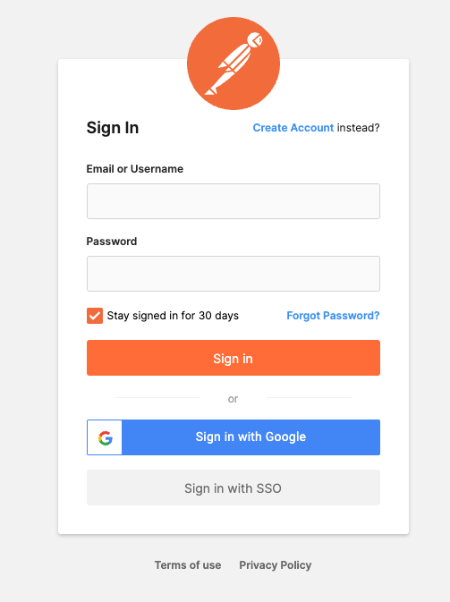
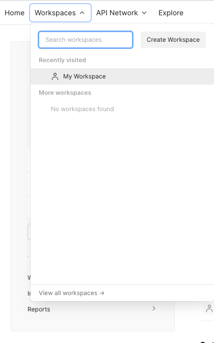
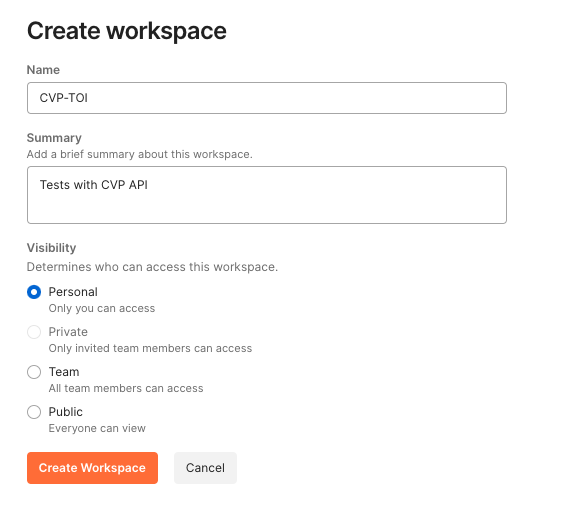
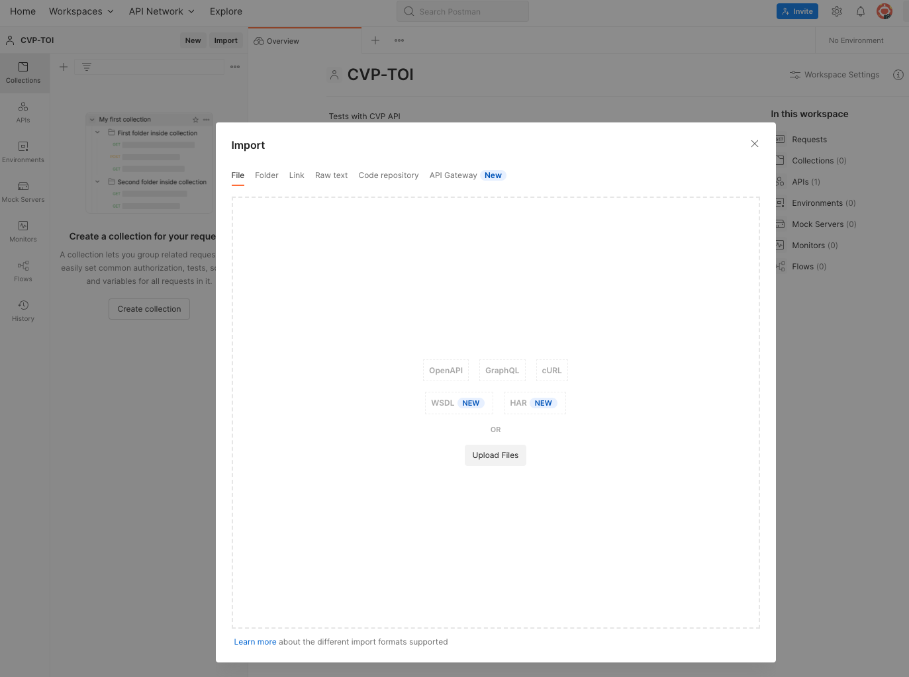
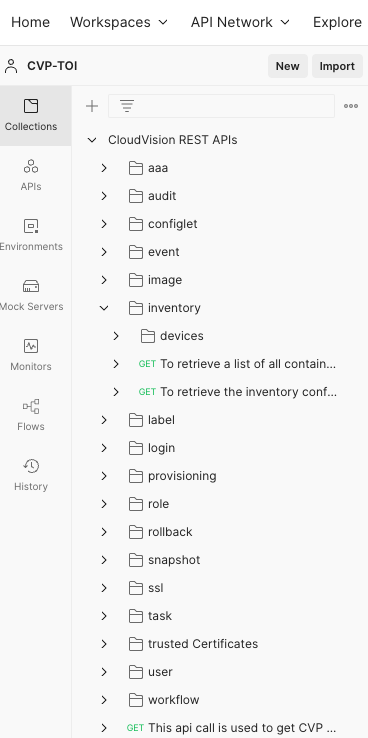
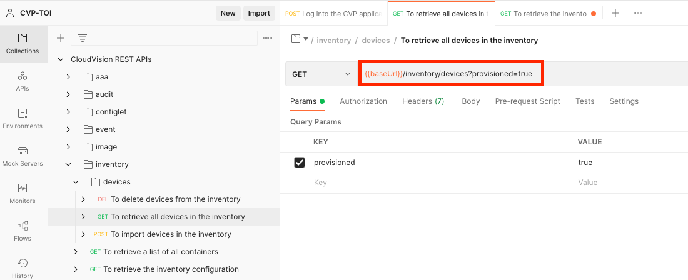
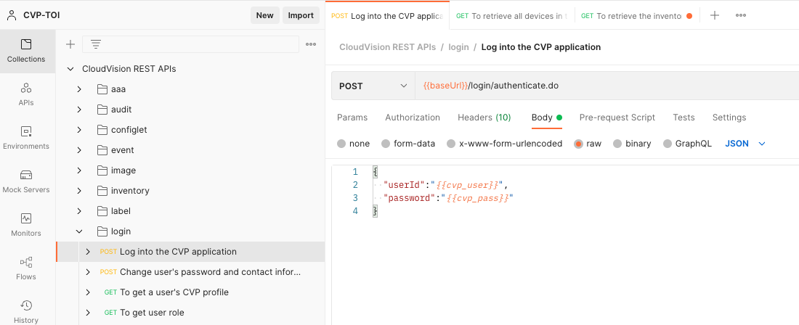
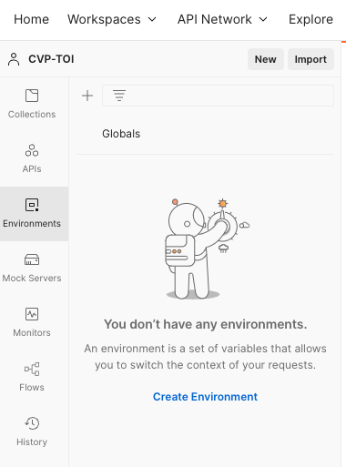
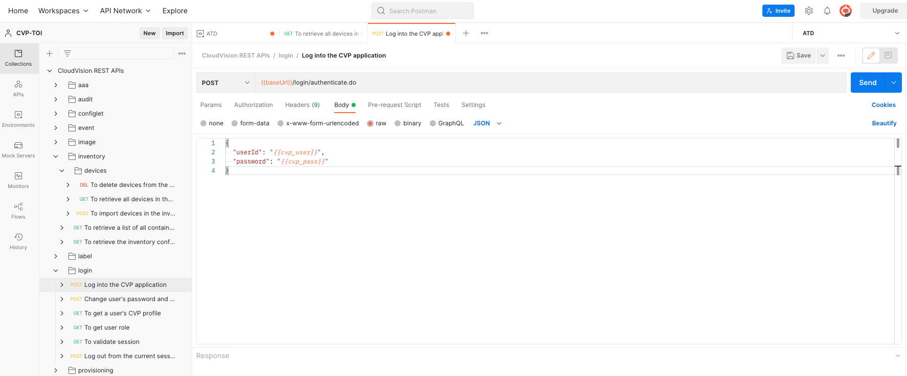

**Table of contents**

- [About Postman](#about-postman)
- [Requirement](#requirement)
- [Login to Postman](#login-to-postman)
- [Create a workspace](#create-a-workspace)
- [Import the OpenAPI file describing the CVP REST APIs](#import-the-openapi-file-describing-the-cvp-rest-apis)
- [Explore the Collection](#explore-the-collection)
- [Create variables in the collection](#create-variables-in-the-collection)
- [Create an Environment](#create-an-environment)
- [Activate the environment](#activate-the-environment)
- [Generate and get a CVP Token](#generate-and-get-a-cvp-token)
- [Use CVP REST APIs](#use-cvp-rest-apis)
- [Export your Postman collection and environement](#export-your-postman-collection-and-environement)

# About Postman

Postman can be used to explore and test API.

Let's use Postman with an OpenAPI file to learn CVP REST APIs

# Requirement

Token based authentication is required. To enable token based authentication, refer to [this directory](../../token_based_authentication)

# Login to Postman

Go to the Postman [website](https://web.postman.co/home)

Login or create a Postman acccount.

# Create a workspace

Once logged in, on the top left side of your Postman homepage, click on **Workspaces** and create a new workspace.

We have a new empty workspace.

# Import the OpenAPI file describing the CVP REST APIs

In this lab we will use the [OpenAPI file](cvp-openapi.yaml) describing the CVP REST APIs.

In your workspace, click on **Collection > Import > File** and import the [OpenAPI file](cvp-openapi.yaml).

# Explore the Collection

You can now see the details of the CVP REST APIs.

Explore the CVP REST APIs collection (methods, parameters, headers...).

# Create variables in the collection

Each URI of the CVP REST APIs collection starts with `{{baseUrl}}`  
The `baseUrl` variable is used by Postman to build the URI of each REST API of this collection.

CVP authenticates APIs with token.  
The REST API that generates and get a token from CVP uses the CVP username and password in its body.  
These values are hardcoded in the OpenAPI file.  

Let's turn them into variables (using double curly brackets).

# Create an Environment

So we need to define three variables to test the CVP REST APIs.  
Let's create an environment to define variables.  

Click on **Environment > Create Environment** in your workspace.

Provide a name to the new environment.  
Define the three variables to be able to use the CVP REST APIs:

- a CVP base URL
- a CVP username
- a CVP password

# Activate the environment

Then activate your environment.

# Generate and get a CVP Token

Navigate to the login section of the Collection.

To generate a token, select `Log into the CVP application`

Send the API request.

Check the response body.  
The token is provided in the body under `access_token` in the `cookie`.

# Use CVP REST APIs

Now we can use CVP REST APIs.  

Let's use Postman to retrieve all devices in the inventory.

Note that you can view the details of the headers.  
The field `cookie` has the token we generated earlier.

The response body can be viewed in different formats (raw, pretty...).

# Export your Postman collection and environement

So you can import them in the futur.

You will find examples in this [directory](Examples).  
