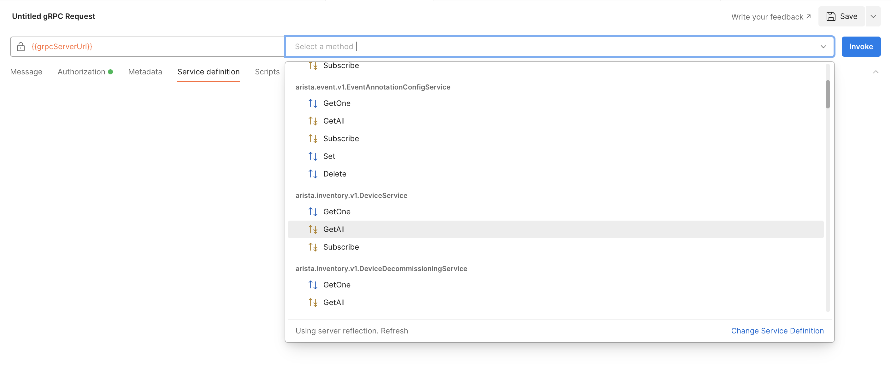
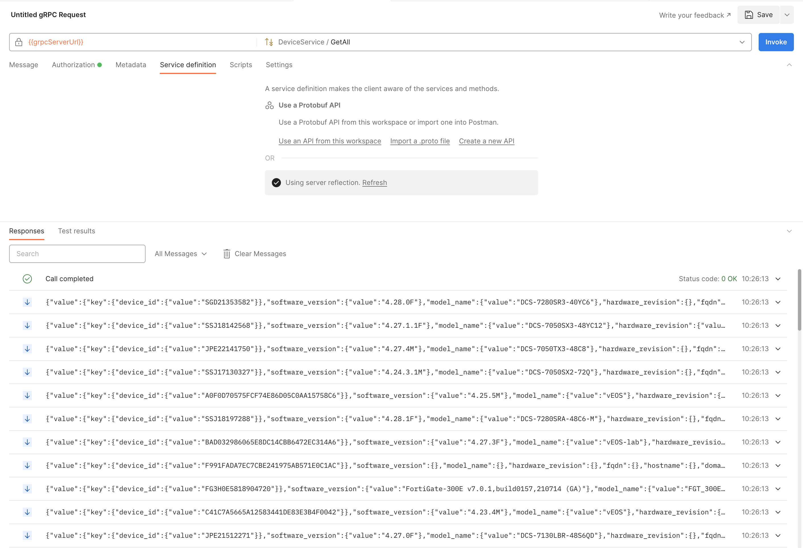
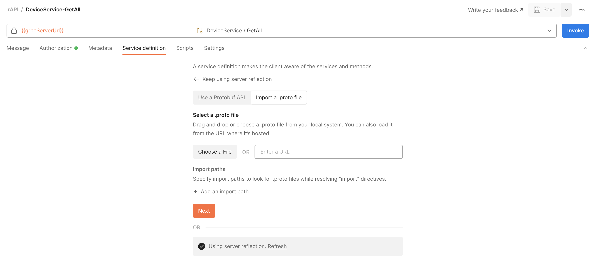
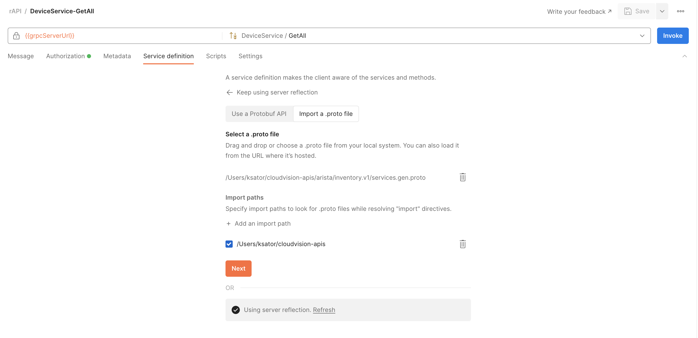
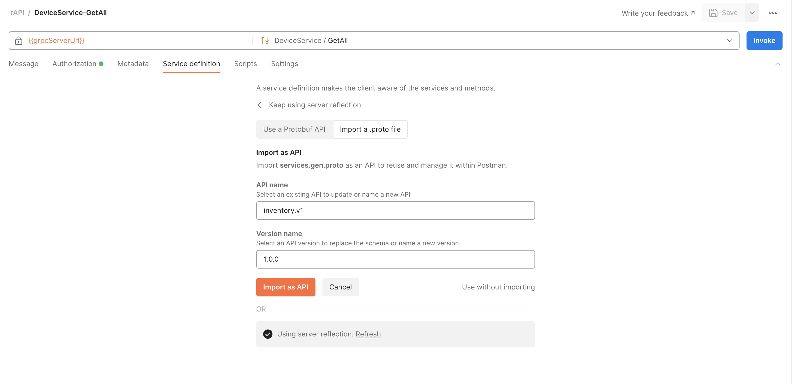
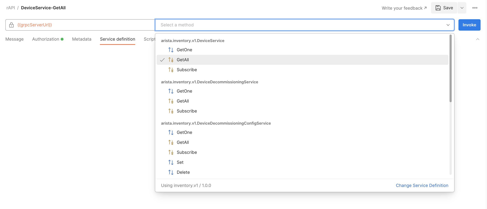
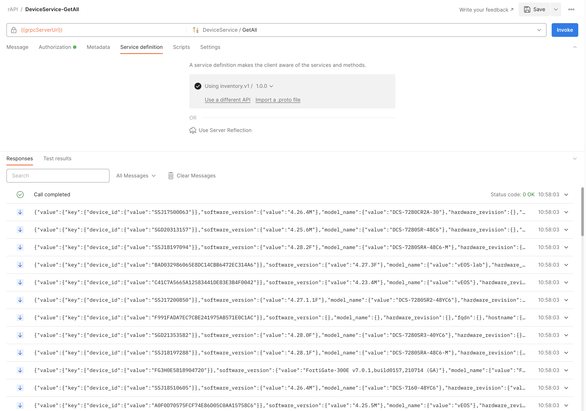
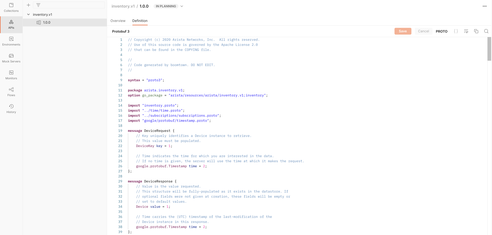

**Table of Contents**

- [Postman and gRPC](#postman-and-grpc)
- [Requirement](#requirement)
- [Install Postman Desktop Agent on your automation setup](#install-postman-desktop-agent-on-your-automation-setup)
- [Create a new workspace or select an existing one](#create-a-new-workspace-or-select-an-existing-one)
- [Create a new environment](#create-a-new-environment)
- [Activate the new environment](#activate-the-new-environment)
- [Create a new request using server reflexion](#create-a-new-request-using-server-reflexion)
- [Create a new request using a .proto file](#create-a-new-request-using-a-proto-file)
  - [Duplicate the previous request](#duplicate-the-previous-request)
  - [Clone the cloudvision-apis repo on your automation setup](#clone-the-cloudvision-apis-repo-on-your-automation-setup)
  - [Import a .proto file](#import-a-proto-file)
  - [Verify the new API](#verify-the-new-api)

# Postman and gRPC

We can use Postman to interact with CVP using gRPC (gNMI, resource APIs).  
The gRPC port is 443 and gPRC uses HTTP2.  

# Requirement

Token based authentication is required. To enable token based authentication, refer to [this directory](../Token%20based%20authentication)

# Install Postman Desktop Agent on your automation setup

Importing a proto file and invoking gRPC services is a new Postman feature.  
To connect with a gRPC server (CVP) requires using Postman Desktop Agent (this is not supported with Postman web).  
In this example we are using Postman Desktop Agent Version 9.26.8.

# Create a new workspace or select an existing one

# Create a new environment

From your workspace, you will need to create and activate a new environment  

Click on **Environment** and create a new environment.  
Provide a name to the new environment.
Define these two variables:

- grpcServerUrl: use the CloudVision IP address
- token: use the token generated previously


# Activate the new environment

Activate the environment.  


# Create a new request using server reflexion

From your workspace, select **New > gRPC Request**


Use the variable `grpcServerUrl` for the server URL  
Select the authorization type `Bearer token`  and use the variable `token` for the token  


Enable TLS


Server reflection is enabled on CVP so you do not have to use the .proto source file.  
Select `Using server reflection` in service definition.  


Once the services are discovered, select as example `arista.inventory.v1.DeviceService.GetAll`.  
The `GetAll` RPC from the `DeviceService` service is defined in the file `arista/inventory.v1/services.gen.proto`  




Click on Invoke.  
You should get a response.  


Save the new request (name it `server-reflection`) to a new collection (name it `rAPI`)

# Create a new request using a .proto file

## Duplicate the previous request

Rename it to `DeviceService-GetAll`  
we will update the service definition using a .proto file

## Clone the cloudvision-apis repo on your automation setup

Resources are modeled with `.proto` files in the repository https://github.com/aristanetworks/cloudvision-apis  
One of `.proto` file is https://github.com/aristanetworks/cloudvision-apis/blob/trunk/arista/inventory.v1/services.gen.proto

```bash
cd $HOME  
pwd
git clone https://github.com/aristanetworks/cloudvision-apis.git 
ls cloudvision-apis
```

## Import a .proto file

Click on `Import a .proto file` in service definition




Select the .proto file from the repo you cloned, and define the import path to use if your .proto file import other .proto files.  


Click on `Next`  
And click on `Import as API` to be able to reuse it in other requests with Postman  



Select the RPC `GetAll` of the `DeviceService` service.  


Click on `Invoke`  


Save this request.

## Verify the new API

From your workspace, verify the new API.
