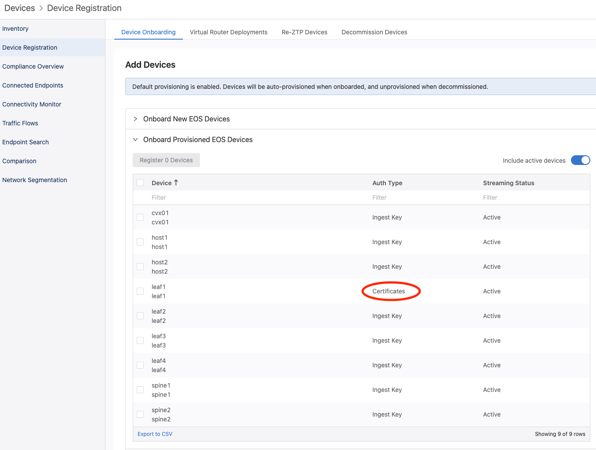

**Table of Contents**

- [Certificate-based authentication](#certificate-based-authentication)
  - [Create a token on CVP](#create-a-token-on-cvp)
  - [Copy the token to the switch](#copy-the-token-to-the-switch)
  - [Configure TerminAttr](#configure-terminattr)
  - [Verify the certificate on the switch](#verify-the-certificate-on-the-switch)
  - [Verify that certificate based authentication is used on CVP](#verify-that-certificate-based-authentication-is-used-on-cvp)
  - [Verify that the device data is still streaming to CVP](#verify-that-the-device-data-is-still-streaming-to-cvp)
  - [Check the device configuration compliance](#check-the-device-configuration-compliance)

# Certificate-based authentication

Certificate-based authentication (for EOS and CVP communication) is required for the devices to stream OpenConfig to CVP.  

Let's configure certificate-based authentication.

## Create a token on CVP

This section describes how to generate manually a token using the CVP GUI.

The token will be then used by the EOS devices in a CSR (Certificate Signing Request) to CVP. 

Go to **Devices > Device Registration**.

Click on `Enroll Certificates` and generate the token.


## Copy the token to the switch

Copy the token.  

Connect to the switch.

Paste the generated token into a temporary file on the device:

- ```bash vi /tmp/token```
- Press `Esc` + `i`
- Paste the token.
- Press `Esc` + `:wq` to save the file.

## Configure TerminAttr

Configure TerminAttr to use a certificate.

```cli
configure
daemon TerminAttr
show active 
```

Update the flag `-cvauth` configuration to use the value `token,/tmp/token` in the daemon TerminAttr configuration.  
This will enable client-side certificate with token-based enrollment.

Then do a `shutdown`/`no shutdown` on the TerminAttr daemon otherwise the change will not be taken into account and then exit the daemon TerminAttr configuration.

```cli
shutdown
no shutdown
exit
```

When the daemon TerminAttr restarts:

- It generates a CSR (Certificate Signing Request)
  - The CN (Common Name) is the device SN.  
- It then uses a CVP API with an HTTP POST to get the certificate.
  - The HTTP body has the token and the CSR.
- CVP has an internal root CA. CVP verifies the token, generates the client certificate and sends it back to the switch
  along with the root CA.
- TerminAttr then discards the token (appends `.backup` to the filename) and will start using the client certificate from
  that point onwards

## Verify the certificate on the switch

In the switch you will now notice that the temporary token has been renamed `token.backup` and that a certificate has been generated.

```cli
bash ls /tmp
bash sudo ls /persist/secure/ssl/terminattr/primary
```

## Verify that certificate based authentication is used on CVP

On the CVP GUI, go to **Devices > Device Registration**.

Select `Onboard Provisioned EOS Devices` and enable the `Include active devices ` toggle.

You can now see how the devices are authenticated (via ingest key or certificate).



## Verify that the device data is still streaming to CVP

On the CVP GUI, go to **Devices > Inventory** and verify the streaming status.

## Check the device configuration compliance

The device configuration is now **out_of_compliance** as there is a difference between the **running configuration** and the **designated configuration**.  

You can see it On the CVP GUI, using **Devices > Inventory** or **Provisionning > Network Provisionning**.  
